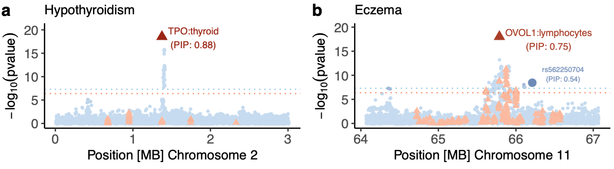

# Tissue-Gene Fine-Mapping (TGFM)

TGFM is a package to fine-map causal tissues and genes at disease-associated loci based on the integration of GWAS dat and multi-tissue-eQTL data. See pre-print to paper here:

[Benjamin J. Strober, Martin Jinye Zhang, Tiffany Amariuta, Jordan Rossen, Alkes L. Price. Fine-mapping causal tissues and genes at disease-associated loci. medRxiv, 2023.](https://www.medrxiv.org/content/10.1101/2023.11.01.23297909v3)




Contact Ben Strober (bstrober3@gmail.com) with any questions.


## Running TGFM

To use, clone the repository: 
```
git clone https://github.com/BennyStrobes/TGFM
cd TGFM
```

Then, create the TGFM package environment (see below). Then check out the [wiki](https://github.com/BennyStrobes/TGFM/wiki) page for further documentation.

## Create TGFM environment
The TGFM environment can be installed using the following two approaches:

### TGFM environment with PIP

TGFM was run for the manuscript using the following python packages installed via PIP:
- Python = 3.7.4
- pandas = 1.3.5
- numpy = 1.21.6
- rpy2 = 3.5.1 
- pandas_plink = 2.2.9
- scipy = 1.7.3

Along with R (4.0.1) and susieR (0.12.35)

### TGFM environment with conda

An alternative (and easier) package installation strategy can be achieved with conda:
```
conda env create -f environment.yml
conda activate TGFM
```

The packages in the conda environment.yml are slightly newer versions of the packages used in the paper / PIP installation above. The reason being was the above package specification was incompatible in conda. We note the same version of susieR was used in both and, importantly, the TGFM output was unchanged with the new environment in limited simulations.


